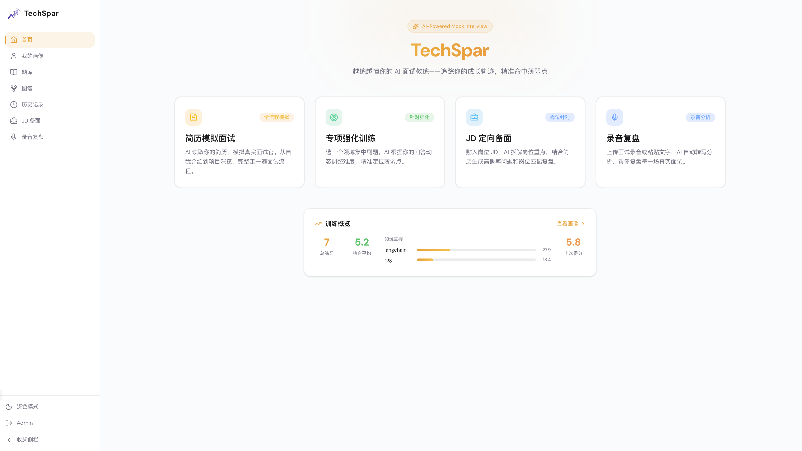
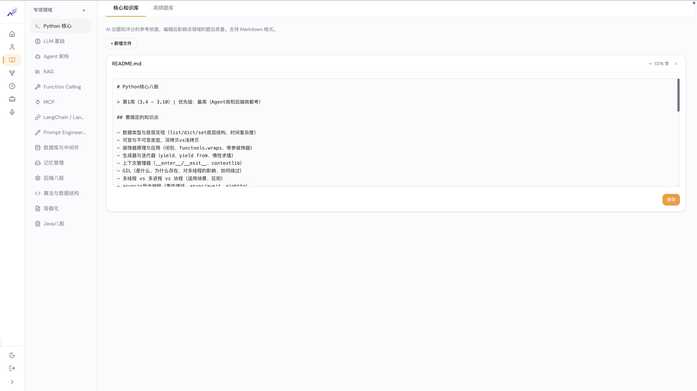
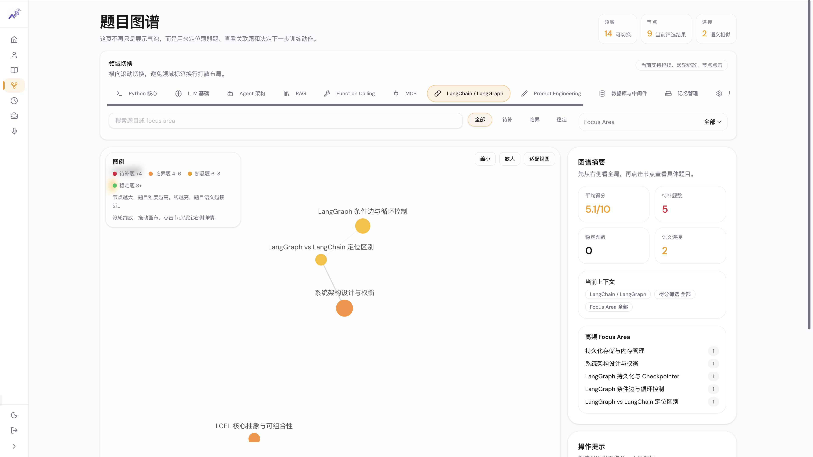
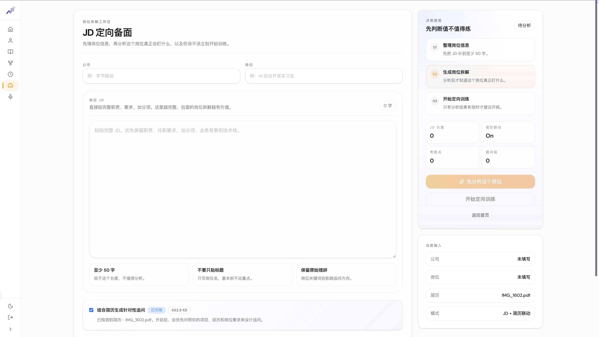
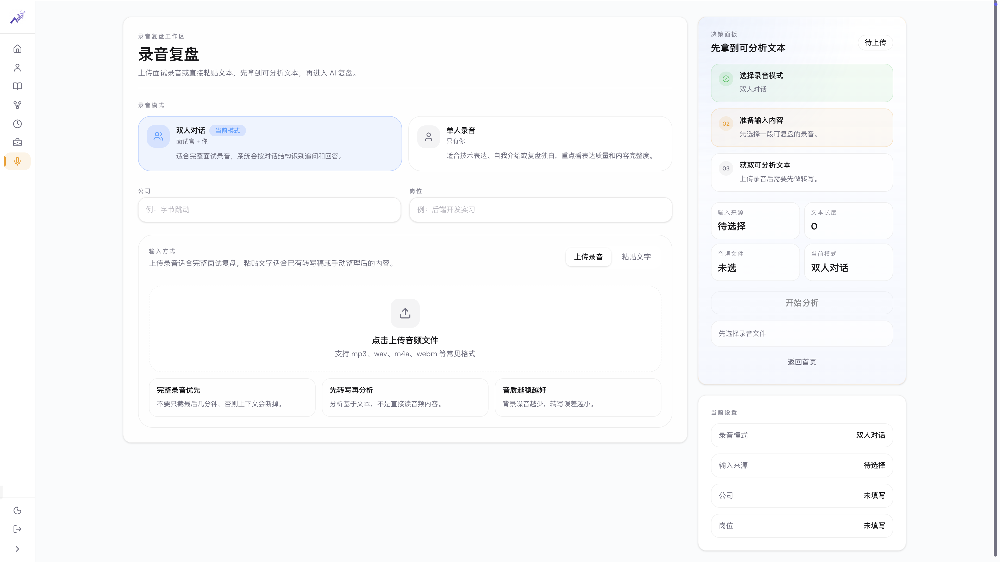

<p align="right">
  <a href="README.md">中文</a>
</p>

<p align="center">
  
</p>

<p align="center">
  <b>An AI interview coach that learns you.</b>
</p>

<p align="center">
  <a href="#quick-start">Quick Start</a> · <a href="#screenshots">Screenshots</a> · <a href="#architecture">Architecture</a> · <a href="LICENSE">MIT License</a>
</p>

Traditional interview tools are stateless — every session starts from scratch with no knowledge of your weak spots or growth trajectory.

TechSpar builds a **persistent candidate profile system**. After each session, it automatically extracts weaknesses, evaluates mastery levels, and records thinking patterns to form a continuously evolving personal profile. The next time it generates questions, the AI interviewer targets your weak spots based on your profile — the more you practice, the better it knows you, and training efficiency grows exponentially.

## Why TechSpar

| Traditional Tools | TechSpar |
|---|---|
| Stateless, starts from zero every time | Long-term memory, tracks growth over time |
| Fixed question bank, random selection | Profile-based, precisely targets weak spots |
| No feedback loop after practice | Per-question scoring + mastery quantification + profile updates |
| No sense of where you stand | 0-100 mastery score with data-driven skill visualization |

## Screenshots

### Landing & Dashboard

| Landing | Dashboard |
| --- | --- |
|  |  |

The landing page introduces the product flow, while the dashboard exposes the main training modes and your current learning snapshot.

### Personal Profile

| Overview | Weaknesses & Strengths | Communication Style |
| --- | --- | --- |
|  |  |  |

The profile page tracks practice statistics, mastery by domain, weak spots, strengths, thinking patterns, and communication habits in one place.

### Knowledge Base & Question Graph

| Knowledge library | Question graph |
| --- | --- |
|  |  |

The knowledge workspace manages domain documents and FAQ content, while the graph view visualizes question clusters and mastery distribution.

### Job-Targeted Prep & Recording Review

| Job-targeted prep | Recording review |
| --- | --- |
|  |  |

TechSpar also supports JD-based interview prep and post-interview recording analysis for targeted practice and structured review.

## Architecture

### Three-Layer Information Fusion for Question Generation

TechSpar doesn't randomly pick questions — it fuses three layers of information to make every question count:

```
┌─────────────────────────────────────────────────┐
│  Layer 3: Global Profile                        │
│  Communication style · Thinking patterns ·      │
│  Cross-domain skill traits                      │
├─────────────────────────────────────────────────┤
│  Layer 2: Topic Profile                         │
│  Mastery 0-100 · Domain weaknesses ·            │
│  Historical training insights                   │
├─────────────────────────────────────────────────┤
│  Layer 1: Session Context                       │
│  Knowledge base retrieval · FAQ bank ·          │
│  Recently practiced questions (deduplication)   │
└─────────────────────────────────────────────────┘
                    ↓ Fused injection
        AI interviewer generates 10 personalized questions
```

- **Mastery determines question type**: 0-30 focuses on concept understanding and comparison, 30-60 balances deep concepts with scenario application, 60-100 goes straight to system design and trade-off analysis
- **Weaknesses determine direction**: First 3 questions precisely target historical weak spots, then gradually expand to new topics
- **History prevents repetition**: Semantic search over the last 20 questions to avoid duplicates
- **Knowledge base ensures accuracy**: Vector retrieval of domain knowledge documents provides factual grounding for questions

### Training → Evaluation → Profile Update Loop

Each training session isn't just practice — it's a complete feedback loop:

```
Answer questions → Batch evaluation (per-question scoring + weakness extraction)
    → Mastery algorithm update (difficulty-weighted scoring)
    → LLM profile update (Mem0-style: ADD / UPDATE / IMPROVE)
    → Vector memory indexing (semantic retrieval of historical insights)
    → More precise questions next time
```

### Three-Layer Display Architecture

| Layer | Page | Focus |
|-------|------|-------|
| Session Review | Training Review | Per-question scoring and improvement suggestions for this session |
| Topic Detail | Domain Detail | Growth trends and review narrative for a single domain |
| Profile | Personal Profile | Global structured data: cross-domain strengths/weaknesses, thinking patterns, skill radar |

## Core Capabilities

**Persistent Memory** — A long-term memory system based on Mem0 architecture. Not a simple append — it uses LLM-driven intelligent updates: ADD (new), UPDATE (revise), and IMPROVE (mark progress) operations on weaknesses, with cosine similarity deduplication to keep profiles refined and compact.

**Directed Question Generation** — Supports generating questions by domain, resume, or job description. The system combines user profile, domain mastery, knowledge retrieval, FAQ bank, and historical deduplication to generate questions dynamically instead of drawing from a fixed question set.

**Algorithmic Mastery Scoring** — A deterministic mastery scoring algorithm. `contribution = (difficulty/5) × (score/10)`, merged with historical scores weighted by answer coverage, ensuring assessment consistency without relying on subjective LLM judgment.

**RAG-Powered Knowledge** — Dual knowledge retrieval: LlamaIndex-indexed domain knowledge documents + bge-m3 vector retrieval of historical training insights, providing factual grounding for question generation and scoring.

## Two Training Modes

### Resume Mock Interview

The AI interviewer reads your resume and drives a complete interview flow via a LangGraph state machine: self-introduction → technical questions → project deep-dive → Q&A. It dynamically follows up based on your answers, adjusting its questioning strategy with your personal profile, simulating the pressure and pace of a real interview.

### Focused Drill

Pick a domain, and the system fuses three layers of context to generate 10 personalized interview questions. After answering, batch evaluation provides per-question scoring, comments, and improvement suggestions, while automatically updating mastery and profile to form a complete training loop.

## Supported Domains

| Domain | | Domain | | Domain |
|--------|---|--------|---|--------|
| 🐍 Python Core | | 🧠 LLM Fundamentals | | 🤖 Agent Architecture |
| 📚 RAG | | 🔧 Function Calling | | 🔌 MCP |
| 🔗 LangChain / LangGraph | | ✍️ Prompt Engineering | | 🗄️ Databases & Middleware |
| 💾 Memory Management | | ⚙️ Backend Fundamentals | | 🧮 Algorithms & Data Structures |

Domains can be freely added or removed via the frontend. Knowledge bases support Markdown editing.

## Quick Start

### 1. Configuration

```bash
cp .env.example .env
```

Edit `.env` with your LLM API credentials (any OpenAI-compatible endpoint):

```env
API_BASE=https://your-llm-api-base/v1
API_KEY=sk-your-api-key
MODEL=your-model-name

# Optional: Embedding model API (leave empty to use local HuggingFace bge-m3)
EMBEDDING_API_BASE=
EMBEDDING_API_KEY=
EMBEDDING_MODEL=BAAI/bge-m3
```

### 2a. Docker (Recommended)

```bash
docker compose up --build
```

Visit `http://localhost` to start. API requests are automatically proxied via Nginx.

### 2b. Manual Setup

```bash
pip install -r requirements.txt
uvicorn backend.main:app --reload --port 8000
```

### 3. Start Frontend

```bash
cd frontend
npm install
npm run dev
```

Open `http://localhost:5173` to start training (or `http://localhost` if using Docker).

## Project Structure

```
TechSpar/
├── backend/
│   ├── main.py              # FastAPI entry, API routes
│   ├── memory.py            # Profile management (Mem0-style)
│   ├── vector_memory.py     # Vector memory (SQLite + bge-m3)
│   ├── indexer.py           # Knowledge base indexing (LlamaIndex)
│   ├── llm_provider.py      # LLM provider layer
│   ├── graphs/
│   │   ├── resume_interview.py  # Resume interview flow (LangGraph)
│   │   └── topic_drill.py       # Focused drill: question generation & evaluation
│   ├── prompts/
│   │   └── interviewer.py       # System prompts
│   └── storage/
│       └── sessions.py          # Session persistence (SQLite)
├── frontend/
│   └── src/
│       ├── pages/           # Home, interview, review, profile, knowledge base, etc.
│       ├── components/      # Shared components
│       └── api/             # API layer
├── data/
│   ├── topics.json          # Domain configuration
│   ├── knowledge/           # Per-domain knowledge documents
│   ├── resume/              # Resume files (.gitignore)
│   └── user_profile/        # User profiles (.gitignore)
├── docker-compose.yml      # Docker deployment
├── backend/Dockerfile      # Backend image
├── frontend/Dockerfile     # Frontend image (Node build → Nginx)
├── .env.example
├── requirements.txt
└── clear_data.sh           # Data cleanup script
```

## Tech Stack

**Backend**: FastAPI · LangChain · LangGraph · LlamaIndex · SQLite · sentence-transformers (bge-m3)

**Frontend**: React 19 · React Router v7 · Vite · Tailwind CSS v4 (responsive mobile-first design)

**LLM**: Any OpenAI-compatible endpoint (local deployment or cloud API)

## License

MIT
